```mermaid
flowchart TD
    %% Local Development
    subgraph Local_Dev["💻 Local Development"]
        L1[Test SnowCLI installation]
        L2[Create config.toml with local creds]
        L3[Run main_deploy.sql locally]
    end
    L1 --> L2 --> L3

    %% Git & Branching
    subgraph Git_Flow["🌿 Git Repository & Branching"]
        G1[Create feature/dev branch]
        G2[Develop or update SQL scripts]
        G3[Update main_deploy.sql]
        G4[Commit changes locally]
        G5[Push to origin dev branch]
    end
    L3 --> G1
    G1 --> G2 --> G3 --> G4 --> G5

    %% GitHub Actions CI/CD
    subgraph CI_CD["⚙️ GitHub Actions CI/CD"]
        C1[Checkout repo]
        C2[Set up Python & install SnowCLI]
        C3[Create config.toml using GitHub Secrets]
        C4[Run main_deploy.sql in Snowflake]
        C5[Optional: capture logs]
    end
    G5 --> C1
    C1 --> C2 --> C3 --> C4 --> C5

    %% Snowflake Environments
    subgraph Snowflake["🏢 Snowflake Environments"]
        S1[DEV Environment]
        S2[UAT Environment]
        S3[PROD Environment]
        S4[Optional Rollback Scripts]
    end
    C4 --> S1 --> S2 --> S3
    S3 --> S4
```

# 🚀 Snowflake CI/CD Deployment using SnowCLI & GitHub Actions

---

## 📌 1. What is SnowCLI?

**SnowCLI** is a Python-based CLI tool for Snowflake that allows you to:

* Execute SQL scripts across environments
* Manage connection profiles via `config.toml`
* Integrate deployments into CI/CD pipelines (GitHub Actions, Jenkins, etc.)
* Work locally to test Snowflake scripts

**Installation (local):**

To test **SnowCLI** locally, you need to install it on your machine. Here’s a **step-by-step guide**.

---

## 📌 2. SnowCLI Deployment Flow Diagram

**Best Practices:**

* Maintain rollback scripts for each deploy
* Keep them in sync with `main_deploy.sql`

---

## 📌 3. Best Practices

1. **Never deploy directly to PROD** 🚫
2. Test in **DEV → UAT → PROD** 🧪
3. Use **one object per file** 📄
4. Maintain **rollback scripts** 🔄
5. Store secrets securely 🔐
6. Follow naming conventions (`001_`, `002_`) 🏷️

---

