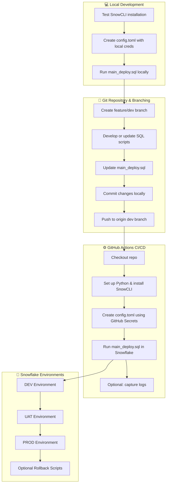

***

# 🚀 Snowflake CI/CD Deployment with SnowCLI & GitHub Actions

Set up a modern, organized Snowflake deployment workflow with Git, SnowCLI, and GitHub Actions—keeping everything secure, modular, and team-ready.

***

## 🗂️ Git Environment Initialization

### 🌐 Create GitHub Repository

- Use GitHub’s web interface to create a new repo (e.g., `CICD-DEMO`).
- **Tip:** Do not initialize with a README; add this locally later.

### 💻 Prepare Your Local Project Folder

```bash
cd ~/local-cicd-demo
```

- Always work in a dedicated folder for each project.

### 🔃 Initialize Git

```bash
git init
```

- Converts your local folder into a Git repository.

***

## 🔗 Connect Local Repo to GitHub

### 🌍 Add Remote Origin

```bash
git remote add origin https://github.com/gkgopikrishnan/CICD-DEMO.git
```

- Connects local changes to the remote GitHub repo.

### 📝 Update Remote (If Needed)

```bash
git remote set-url origin https://github.com/gkgopikrishnan/CICD-DEMO.git
```

- Use only for updates after renaming or moving the repo.

***

## 🌿 Safe Branching for Development

### ✨ Create Development Branch

```bash
git checkout -b emp_dev_main
```
- Pushes local branch to remote & sets upstream

- Note : Always develop on specific feature/dev branches, not directly on production.

***

## 📦 Note

- Keeps scripts organized and execution predictable.
- **Best Practice:** Prefix filenames (e.g., `001_create_table.sql`).

### 🏠 Verify Directory Structure

```bash
tree -L 2
```

Expected:

```
local-cicd-demo/
├── deploy/
├── scripts/
│   ├── tables/
│   ├── views/
│   └── procedures/
```

***

## 🌳 Mirror Structure in GitHub for CI/CD

Replicate the same organized folder structure in your GitHub repo for consistency:

```
sf-deployment-cli/
├── scripts/
│   ├── procedures/
│   ├── tables/
│   ├── views/
│   └── main_deploy.sql
├── rollback/
│   └── rollback.sql
├── .github/
│   └── workflows/
│       └── deploy-to-snowflake.yml
└── README.md
```

- Maintains clarity and traceability for each environment and stage.

***

## ⚙️ Set Up GitHub Actions CI/CD

### 🔑 Direct creds

```yaml 

name: Deploy to Snowflake with Direct Creds (Dev)

on:
  push:
    branches:
      - emp_dev_main

jobs:
  deploy:
    runs-on: ubuntu-latest
    steps:
      - name: Checkout code
        uses: actions/checkout@v3

      - name: Set up Python & Install Snowflake CLI
        run: |
          set -x
          python3 -m pip install --upgrade pip
          pip install snowflake-cli-labs
          echo "$HOME/.local/bin" >> $GITHUB_PATH
          hash -r
          snow --version || echo "Snow CLI not found"

      - name: Run Snowflake deploy
        run: |
          set -e
          # Fail fast if required env vars are missing
          : "${SNOWFLAKE_ACCOUNT:?Missing SNOWFLAKE_ACCOUNT}"
          : "${SNOWFLAKE_USER:?Missing SNOWFLAKE_USER}"
          : "${SNOWFLAKE_PASSWORD:?Missing SNOWFLAKE_PASSWORD}"
          : "${SNOWFLAKE_ROLE:?Missing SNOWFLAKE_ROLE}"
          : "${SNOWFLAKE_WAREHOUSE:?Missing SNOWFLAKE_WAREHOUSE}"
          : "${SNOWFLAKE_DATABASE:?Missing SNOWFLAKE_DATABASE}"
          : "${SNOWFLAKE_SCHEMA:?Missing SNOWFLAKE_SCHEMA}"

          echo "🔁 Running Snowflake deploy script via Snow CLI with temporary connection..."
          snow sql \
            --temporary-connection \
            --account "$SNOWFLAKE_ACCOUNT" \
            --user "$SNOWFLAKE_USER" \
            --password "$SNOWFLAKE_PASSWORD" \
            --role "$SNOWFLAKE_ROLE" \
            --warehouse "$SNOWFLAKE_WAREHOUSE" \
            --database "$SNOWFLAKE_DATABASE" \
            --schema "$SNOWFLAKE_SCHEMA" \
            --filename deploy/main_deploy.sql
          ret=$?
          echo "Snowflake CLI exit code: $ret"
          if [ $ret -ne 0 ]; then
            echo "❌ Snowflake CLI execution failed"
            exit $ret
          else
            echo "✅ Snowflake CLI executed successfully"
          fi
        env:
          SNOWFLAKE_ACCOUNT: BDXRNPG-JN71181
          SNOWFLAKE_USER: SFTRAINING
          SNOWFLAKE_PASSWORD: GoodSuperluck2025
          SNOWFLAKE_ROLE: ACCOUNTADMIN
          SNOWFLAKE_WAREHOUSE: COMPUTE_WH
          SNOWFLAKE_DATABASE: CICD_DEV_EMP_DB
          SNOWFLAKE_SCHEMA: CICD_DEV_EMP_DB_SCH
```

### 🔑 Secure Secrets with GitHub

**Add these as GitHub repo secrets:**
Add the following **Secrets** in your repository → **Settings → Secrets**:

* `SNOWFLAKE_ACCOUNT`  
* `SNOWFLAKE_USER`  
* `SNOWFLAKE_PASSWORD`  
* `SNOWFLAKE_ROLE`  
* `SNOWFLAKE_DATABASE`  
* `SNOWFLAKE_SCHEMA`  
* `SNOWFLAKE_WAREHOUSE`  

> These secrets **replace local credentials** in CI/CD pipelines and should never be committed.


### 📝 Sample GitHub Actions Workflow

`deploy-to-snowflake.yml`:

```yaml
name: Deploy to Snowflake with Secret Creds (Dev)

on:
  push:
    branches:
      - emp_dev_main

jobs:
  deploy:
    runs-on: ubuntu-latest
    environment: ci-cd-demo-dev-env

    steps:
      - name: Checkout code
        uses: actions/checkout@v3

      - name: Set up Python & Install Snowflake CLI
        run: |
          python3 -m pip install --upgrade pip
          pip install snowflake-cli-labs
          echo "$HOME/.local/bin" >> $GITHUB_PATH

      - name: Create snowflake config file (from environment secrets)
        run: |
          mkdir -p ~/.snowflake
          cat <<EOF > ~/.snowflake/config.toml
          [connections.default]
          account   = "${{ secrets.DEV_SNOWFLAKE_ACCOUNT }}"
          user      = "${{ secrets.DEV_SNOWFLAKE_USERNAME }}"
          password  = "${{ secrets.DEV_SNOWFLAKE_PASSWORD }}"
          role      = "${{ secrets.DEV_SNOWFLAKE_ROLE }}"
          warehouse = "${{ secrets.DEV_SNOWFLAKE_WAREHOUSE }}"
          database  = "${{ secrets.DEV_SNOWFLAKE_DATABASE }}"
          schema    = "${{ secrets.DEV_SNOWFLAKE_SCHEMA }}"
          EOF
          chmod 600 ~/.snowflake/config.toml

      - name: Run Snowflake Deployment using connection profile
        run: |
          set -x
          echo "🔁 Running Snowflake deploy script via Snow CLI with connection profile..."

          snow sql --connection default --filename deploy/main_deploy.sql
          ret=$?
          echo "Snowflake CLI exit code: $ret"
          if [ $ret -ne 0 ]; then
            echo "❌ Snowflake CLI execution failed"
            exit $ret
          else
            echo "✅ Snowflake CLI executed successfully"
          fi

```

- **Never expose credentials. Always use secrets for all sensitive configuration.**

***

## 🔄 Rollback Scripts for Safe Recovery

- Place all rollback scripts in `rollback/`.
- Example (`rollback/rollback.sql`):

```sql
DROP VIEW IF EXISTS my_view;
DROP TABLE IF EXISTS my_table;
```

- Always validate rollbacks in DEV before promoting upwards.

***

## 🌊 CI/CD Deployment Flow Overview



***

## 🏆 Best Practice Checklist

- 🚫 Never deploy directly to PROD
- 🧪 Test changes in **DEV → UAT → PROD**
- 📄 One object per script file
- 🔄 Maintain rollback scripts for each deployment
- 🔐 Store all credentials using **GitHub Secrets**
- 🏷️ Prefix scripts for predictable order (`001_`, `002_`)
- 📚 Document everything in a detailed `README.md`
- 📂 Uniform structure locally and in the repo for accuracy

***


